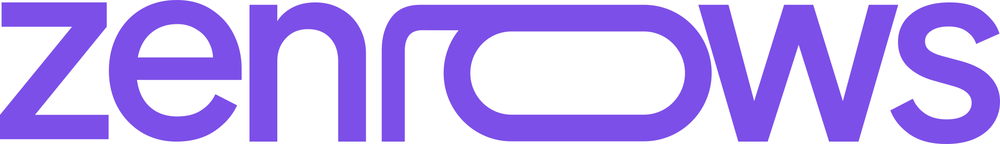

    <picture>
        <source media="(prefers-color-scheme: dark)" srcset=".github/assets/logo/dark.svg"/>
        
    </picture>

    <a href="https://docs.zenrows.com?utm_source=github.com&utm_medium=social&utm_campaign=zenrows-go-sdk">Documentation</a>
    &nbsp;·&nbsp;
    <a href="https://www.zenrows.com/pricing?utm_source=github.com&utm_medium=social&utm_campaign=zenrows-go-sdk">Pricing</a>

 

# ZenRows Go SDK

ZenRows® provides a powerful web scraping toolkit to help you collect, process, and manage web data effortlessly.
Whether you need scalable data extraction, a robust browser solution for dynamic websites or residential proxies to
access geo-targeted content, we have the right tools for your specific use cases.

This repository hosts the official Go SDKs for integrating with different ZenRows services. Each SDK is located in
its respective subdirectory and includes comprehensive documentation, installation instructions, and usage examples.

## Table of Contents

- [Overview](#overview)
- [SDKs](#sdks)
    - [Fetch Service](#fetch-service)
    - [Batch API Service](#batch-api-service)
- [Other Languages](#other-languages)
- [Contributing](#contributing)
- [License](#license)

## SDKs

### Fetch Service

> ZenRows®’ Fetch API enables fast, efficient, and hassle-free data extraction from web pages by providing versatile
scraping modes. Whether you’re new to scraping or already experienced, ZenRows adapts to your needs, making it easy to
collect data from the web while overcoming the common challenges posed by modern websites, including CAPTCHAs
and anti-bot mechanisms.

**Directory**: [`service/api`](./service/api)

The `service/api` SDK is a Go client for the ZenRows Fetch API, allowing developers to send HTTP requests to scrape 
websites with support for various configurations like JavaScript rendering, custom headers, retries, and more.

- [Installation and Usage](./service/api/README.md)
- [API Reference](https://docs.zenrows.com/scraper-api/api-reference)

### Batch API Service

> The Batch API (beta) runs many URLs asynchronously as a job — submit once, and it tracks progress
and serves results back to you. A job can stay **open** to accept tasks over time, or run as a
one-shot batch with every task known upfront.

**Directory**: [`service/batch`](./service/batch)

- [Installation and Usage](./service/batch/README.md)

## Other Languages

- **Node.js**:
  - [Fetch](https://github.com/ZenRows/zenrows-node-sdk)
  - [Scraping Browser](https://github.com/ZenRows/browser-js-sdk)
- **Python**:
  - [Fetch](https://github.com/ZenRows/zenrows-python-sdk)

## Contributing

Contributions to the SDKs are welcome! See [CONTRIBUTING.md](./CONTRIBUTING.md) for more information on how to 
contribute to the repository.

## License

This project is licensed under the MIT License - see the [LICENSE](./LICENSE) file for details.
